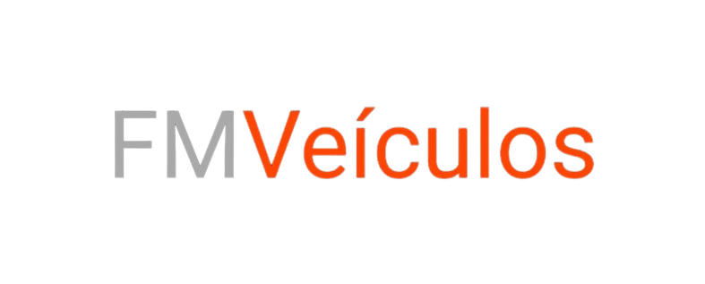

# FMVeículos App


---

## 📃 Descrição

O **FMVeículos App** é um aplicativo Android desenvolvido em **Kotlin** para gerenciar vendas e interesses em veículos de uma concessionária. Ele utiliza o **[Firebase](https://firebase.google.com/)** para autenticação, armazenamento de dados e imagens, oferecendo uma experiência fluida para administradores e clientes.

O projeto segue uma arquitetura **MVP (Model-View-Presenter)**, garantindo separação de responsabilidades, manutenção simplificada e escalabilidade. A interface é responsiva, com layouts adaptados para diferentes tamanhos de tela, e inclui animações para melhorar a experiência do usuário.

Assista à apresentação do projeto:  
- [Parte 1](https://youtu.be/jwXPy-maq4Q)  
- [Parte 2](https://youtu.be/EmIp1Qk3-Ik)

---

## 💻 Tecnologias Utilizadas

- **Kotlin 2.2.0** → Linguagem de programação principal.
- **Android Gradle Plugin 8.11.1** → Desenvolvimento nativo para Android.
- **Firebase** [](https://firebase.google.com/):
  - **Authentication 23.2.1** → Gerenciamento de login e registro.
  - **Firestore 25.1.4** → Banco de dados NoSQL para carros e interesses.
  - **Storage 22.0.0** → Armazenamento de imagens de veículos.
- **Glide 4.16.0** → Carregamento eficiente de imagens.
- **AAChartCore-Kotlin 7.2.3** → Gráficos para relatórios de vendas.
- **Coroutines** → Gerenciamento de operações assíncronas (integrado ao Kotlin).
- **MVP Architecture** → Separação entre Model, View e Presenter.
- **Navigation** → Navegação centralizada com a classe `Navigator`.
- **AndroidX**:
  - **Core KTX 1.16.0** → Extensões Kotlin para Android.
  - **AppCompat 1.7.1** → Compatibilidade com versões anteriores do Android.
  - **Material 1.12.0** → Componentes de interface Material Design.
  - **Activity 1.10.1** → Gerenciamento de atividades.
  - **ConstraintLayout 2.2.1** → Layouts flexíveis.
  - **GridLayout 1.1.0** → Layouts em grade.

---

## 🛎️ Funcionalidades

### 🔹 Autenticação
- **Login** e **Registro** com validação de CPF e email.
- Suporte a recuperação de senha via email.
- Diferenciação entre usuários administradores (domínio @fmveiculos.com) e clientes.

### 🔹 Gerenciamento de Veículos
- **Catálogo de Veículos**:
  - Exibe lista de veículos em um GridView com imagens, nomes e detalhes.
  - Suporte a clique para visualizar detalhes completos (marca, preço, descrição, categoria, ano de lançamento).
- **Reposição de Estoque**:
  - Cadastro de novos veículos com upload de imagens (galeria ou câmera).
  - Atualização de quantidade e preço de veículos existentes.

### 🔹 Registro de Interesses
- Clientes podem registrar interesse em veículos.
- Administradores podem confirmar ou cancelar interesses pendentes.
- Exibição de histórico de interesses com status (Pendente, Confirmado, Cancelado).

### 🔹 Relatórios
- Gráficos de interesses confirmados por mês, gerados com AAChartCore-Kotlin.
- Visualização detalhada de interesses em uma RecyclerView.

### 🔹 Experiência do Usuário
- **Responsividade**:
  - Layouts adaptados com `ViewCompat` e `WindowInsetsCompat` para telas edge-to-edge.
- **Animações**:
  - Efeitos de destaque em botões e transições suaves entre telas.
- **Formatação**:
  - Máscara de CPF automática no registro.
  - Formatação de preços e datas para melhor legibilidade.
- **Integração com WhatsApp**:
  - Botão para contato direto via WhatsApp com número predefinido.

### 🔹 Gerenciamento de Estado
- Estados de **Loading**, **Success**, **Error** e **No Data** para operações assíncronas.
- Feedback via Toast para ações do usuário (ex.: sucesso no login, erro no cadastro).

---

## 📱 Responsividade

- Uso de `ViewCompat` e `WindowInsetsCompat` para suporte a telas edge-to-edge.
- Layouts baseados em `GridView` e `RecyclerView` para exibição dinâmica.
- A classe `Navigator` centraliza a navegação, garantindo transições consistentes.
- Textos e imagens ajustados dinamicamente com `SpannableString` para estilização.

---

## ▶️ Como Rodar o Projeto

### Pré-requisitos
- **Android Studio** (versão mais recente, recomendada: Koala ou superior).
- **JDK 17** ou superior.
- Conta no **[Firebase](https://firebase.google.com/)** para autenticação e banco de dados.
- **Emulador Android** ou dispositivo físico com Android 5.0+.
- **ADB** (Android Debug Bridge) configurado para conexão com dispositivos.

### Passos para Executar no Android Studio
1. **Clone o Repositório**:
   ```bash
   git clone https://github.com/seu-user/fmveiculos-app.git
   cd fmveiculos-app
